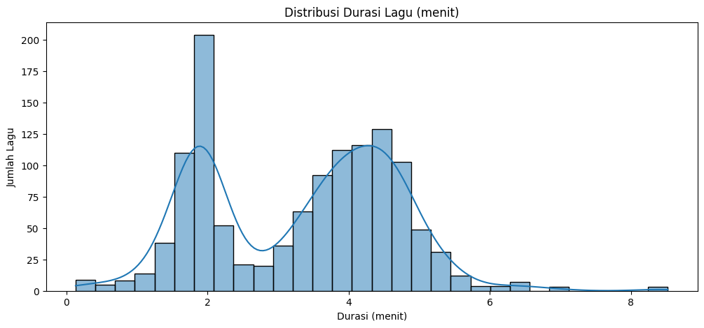

# 🎧 **Laporan Proyek Machine Learning – Krismono Sadi**

## 📌 Sistem Rekomendasi Lagu Spotify

### 🔍 Sumber Data

Dataset dikumpulkan melalui proses *scraping* menggunakan **Spotify Web API** resmi. Dokumentasi lengkap API dapat diakses melalui tautan berikut:

👉 [Spotify Developer API](https://developer.spotify.com/documentation/web-api?directory=true)

Dataset hasil *scraping* dapat diakses secara terbuka di Kaggle:
🎵 [Kaggle Dataset - Spotify Music Cris](https://www.kaggle.com/datasets/krismonosadi/spotify-music-cris)

---

## 🎵 Domain Proyek: Sistem Rekomendasi Musik

**Kategori Proyek**:

* Recommender System
* Information Retrieval
* Content-Based Filtering
* Machine Learning for Media & Entertainment

**Penjelasan**:

Proyek ini berada dalam domain sistem rekomendasi musik, cabang dari *Information Retrieval* dan *Machine Learning* yang berfokus pada pemberian rekomendasi lagu yang relevan kepada pengguna. Sistem ini menggunakan pendekatan **Content-Based Filtering**, yaitu memberikan rekomendasi berdasarkan kemiripan fitur lagu seperti durasi dan popularitas.

Ciri khas sistem ini:

* Tidak bergantung pada data interaksi pengguna seperti *ratings*, *likes*, atau *play history*.
* Rekomendasi diberikan berdasarkan fitur konten lagu itu sendiri.
* Bukan termasuk *Collaborative Filtering* karena tidak menggunakan profil pengguna.

---

## 📖 Project Overview

Di era digital saat ini, platform streaming musik seperti Spotify memiliki jutaan lagu, sehingga pengguna sering kesulitan menemukan lagu yang sesuai selera mereka. Sistem rekomendasi musik berperan penting dalam mengatasi tantangan ini dengan membantu pengguna menemukan lagu baru yang relevan.

Proyek ini mengembangkan sistem rekomendasi berbasis konten (**Content-Based Filtering**) yang menyarankan lagu-lagu mirip berdasarkan fitur numerik (contoh: durasi lagu dan popularitas) serta informasi artis. Sistem ini tidak memerlukan data interaksi eksplisit pengguna, sehingga cocok untuk kondisi *cold-start* atau pengguna baru.

---

## 🧠 Business Understanding

### 🎯 Problem Statements

* Bagaimana memberikan rekomendasi lagu yang relevan berdasarkan fitur lagu?
* Bagaimana mengevaluasi sistem rekomendasi tanpa data interaksi pengguna?

### ✅ Goals

* Mengembangkan sistem rekomendasi **Top-N Lagu** menggunakan **Content-Based Filtering** berbasis fitur lagu.
* Melakukan evaluasi sistem menggunakan metrik **Precision\@K** dengan proxy relevansi lagu dari artis yang sama.
* Melakukan *data preparation* yang komprehensif untuk menjamin kualitas data.

### 💡 Solution Approach

* Menggunakan algoritma **Content-Based Filtering** dengan fitur numerik lagu seperti `popularity` dan `duration_ms`.
* Normalisasi fitur menggunakan **MinMaxScaler** untuk skala yang konsisten sebelum menghitung kemiripan dengan **Cosine Similarity**.
* Evaluasi relevansi menggunakan lagu dari artis yang sama sebagai proxy untuk menghitung **Precision\@K**.

---

## 📊 Data Understanding

**Dataset ini telah diunggah secara publik di Kaggle agar dapat diakses langsung oleh siapa saja.**

Dataset dikumpulkan secara mandiri melalui *scraping* menggunakan **Spotify Developer API**:

👉 [Spotify Developer API](https://developer.spotify.com/documentation/web-api?directory=true)

Dataset hasil *scraping* dapat diakses secara terbuka di Kaggle:
🎵 [Kaggle Dataset - Spotify Music Cris](https://www.kaggle.com/datasets/krismonosadi/spotify-music-cris)

Dataset berisi metadata lagu dari Spotify dengan 5.624 entri lagu, dan Data meliputi nama lagu, artis, popularitas, durasi, hingga tanggal rilis.

---

**Variabel utama (kolom) dan Deskripsi Fitur Dataset**

| **Kolom**         | **Deskripsi**                                                                                                                                                                                                                                                                                                                        |
| ----------------- | ------------------------------------------------------------------------------------------------------------------------------------------------------------------------------------------------------------------------------------------------------------------------------------------------------------------------------------ |
| **name**          | Nama lagu yang direkam pada dataset. Kolom ini tidak memiliki nilai kosong, sehingga semua lagu memiliki nama yang tercatat dengan lengkap.                                                                                                                                                                                          |
| **artist**        | Nama artis atau band yang membawakan lagu tersebut. Tidak ada nilai kosong, sehingga setiap lagu terasosiasi dengan artis yang jelas.                                                                                                                                                                                                |
| **album**         | Nama album tempat lagu tersebut termasuk. Semua lagu memiliki informasi album lengkap, tanpa nilai kosong. Memberikan konteks koleksi lagu yang dirilis bersama-sama.                                                                                                                                                                |
| **popularity**    | Skor popularitas lagu, berupa nilai numerik antara 0 sampai 100. Kolom ini lengkap tanpa nilai kosong, mencerminkan popularitas lagu berdasarkan jumlah pemutaran, tren, dan engagement pengguna.                                                                                                                                    |
| **explicit**      | Status lagu apakah mengandung konten eksplisit atau tidak. Nilainya lengkap tanpa kosong, berupa `True` atau `False`. Berguna untuk filtering berdasarkan usia atau kebijakan platform.                                                                                                                                              |
| **release\_date** | Tanggal resmi lagu tersebut dirilis ke publik, dengan format `YYYY-MM-DD` atau `YYYY`. Tidak ada nilai kosong, sehingga semua lagu memiliki tanggal rilis yang tercatat.                                                                                                                                                             |
| **duration\_ms**  | Durasi lagu dalam satuan milidetik (ms). Kolom ini lengkap tanpa nilai kosong. Untuk interpretasi yang lebih mudah, durasi bisa dikonversi ke menit dan detik (misal: 3 menit 45 detik).                                                                                                                                             |
| **preview\_url**  | URL menuju potongan singkat lagu (preview) yang dapat diputar secara online. Kolom ini memiliki banyak nilai kosong (5624), artinya sebagian besar lagu tidak memiliki link preview yang tersedia. Biasanya preview berdurasi sekitar 30 detik dan membantu pengguna mendengarkan sampel lagu sebelum memutuskan memutar lagu penuh. |

**Statistik dan kualitas data:**

* Total data: 5.624 baris, 8 kolom.
* Nilai kosong ada pada kolom `preview_url` (semua kosong).
* Terdapat 4.398 baris duplikat berdasarkan kombinasi name dan artis.
* Terdapat 4.379 baris duplikat Seluruh Kolom
* Outlier ditemukan pada fitur `popularity` dan `duration_ms`.

### Tabel Struktur Data

| No | Kolom         | Non-Null Count | Tipe Data |
|----|---------------|----------------|-----------|
| 0  | name          | 5624           | object    |
| 1  | artist        | 5624           | object    |
| 2  | album         | 5624           | object    |
| 3  | popularity    | 5624           | int64     |
| 4  | explicit      | 5624           | bool      |
| 5  | release_date  | 5624           | object    |
| 6  | duration_ms   | 5624           | int64     |
| 7  | preview_url   | 0              | float64   |

**Total Baris**: 5624  
**Total Kolom**: 8  
**Penggunaan Memori**: ~313.2+ KB  

**Penjelasan :**

| Kolom          | Penjelasan                                                                                                                                                                                          |
| -------------- | --------------------------------------------------------------------------------------------------------------------------------------------------------------------------------------------------- |
| `name`         | Nama atau judul lagu. Bertipe *object* karena berisi teks.                                                                                                                                          |
| `artist`       | Nama artis atau grup yang membawakan lagu. Bertipe *object*.                                                                                                                                        |
| `album`        | Nama album tempat lagu tersebut dirilis. Bertipe *object*.                                                                                                                                          |
| `popularity`   | Skor popularitas lagu dari Spotify, biasanya bernilai antara 0–100. Bertipe *int64*.                                                                                                                |
| `explicit`     | Menunjukkan apakah lagu mengandung konten eksplisit (True/False). Bertipe *bool*.                                                                                                                   |
| `release_date` | Tanggal rilis lagu. Saat ini masih bertipe *object*, biasanya akan diubah ke format *datetime* untuk analisis waktu.                                                                                |
| `duration_ms`  | Durasi lagu dalam satuan milidetik. Bertipe *int64*, biasanya dikonversi ke menit untuk kemudahan interpretasi.                                                                                     |
| `preview_url`  | Link untuk mendengarkan cuplikan lagu. Namun seluruh nilai kosong (*non-null count = 0*), sehingga tidak berguna dalam analisis dan dapat dihapus. Bertipe *float64* karena seluruh nilainya `NaN`. |

🧾 Rangkuman
Total Baris: 5.624 lagu/artis/entri.

Total Kolom: 8 fitur.

Penggunaan Memori: Sekitar 313.2 KB, relatif kecil dan ringan untuk diolah.

💡 Insight Awal
Kolom preview_url tidak memiliki nilai valid sama sekali, sehingga tidak berkontribusi terhadap model dan layak untuk dihapus.

Kolom release_date perlu diubah ke format datetime untuk analisis berbasis waktu.

Semua kolom non-null (kecuali preview_url), sehingga tidak diperlukan penanganan missing values selain kolom tersebut.

---

### Jumlah missing values

| Kolom         | Nilai Kosong |
| ------------- | ------------ |
| name          | 0            |
| artist        | 0            |
| album         | 0            |
| popularity    | 0            |
| explicit      | 0            |
| release\_date | 0            |
| duration\_ms  | 0            |
| preview\_url  | 5624         |

**Penjelasan :**

Mayoritas Kolom Tidak Memiliki Nilai Kosong
Semua kolom penting untuk analisis seperti name, artist, popularity, dan duration_ms tidak memiliki nilai kosong. Ini menandakan kualitas data cukup baik dan siap untuk diproses lebih lanjut tanpa perlu imputasi.

Kolom preview_url Berisi Seluruhnya Kosong
Kolom ini memiliki 100% missing values (5624 dari 5624 baris), sehingga tidak berguna dalam analisis atau modeling.
✅ Tindakan yang Disarankan: Kolom ini sebaiknya dihapus dari dataset untuk efisiensi dan kebersihan data.

### Deskripsi Statistik (df.describe())

| Statistik | popularity  | duration\_ms | preview\_url |
| --------- | ----------- | ------------ | ------------ |
| count     | 5624.000000 | 5624.000000  | 0.0          |
| mean      | 15.677809   | 197499.4232  | NaN          |
| std       | 15.031440   | 81228.9246   | NaN          |
| min       | 0.000000    | 7786.0000    | NaN          |
| 25%       | 4.000000    | 116571.0000  | NaN          |
| 50%       | 13.000000   | 217079.0000  | NaN          |
| 75%       | 24.000000   | 262133.0000  | NaN          |
| max       | 87.000000   | 511306.0000  | NaN          |

**Penjelasan :**

popularity (Skor Popularitas Lagu):

Nilai berkisar dari 0 hingga 87, dengan rata-rata sekitar 15.68.

Skor popularitas cenderung rendah, terlihat dari nilai median (50%) di 13, menunjukkan bahwa sebagian besar lagu dalam dataset kurang dikenal atau memiliki jangkauan terbatas di platform.

duration_ms (Durasi Lagu dalam Milidetik):

Rata-rata durasi lagu adalah sekitar 197.499 ms (~3 menit 17 detik).

Nilai minimum sekitar 7.786 ms (kemungkinan anomali atau outlier), dan maksimum lebih dari 511.000 ms (~8 menit 31 detik), menunjukkan adanya variasi durasi yang cukup besar.

preview_url:

Semua nilainya kosong (count = 0), sehingga kolom ini tidak mengandung informasi yang dapat digunakan dan sebaiknya dihapus.

---

### Cek Outlier (tanpa hapus dulu, cukup identifikasi)

Jumlah outlier per fitur:
popularity     188
duration_ms     12
preview_url      0
dtype: int64

**Penjelasan :**

popularity memiliki 188 outlier. Ini dapat mencakup lagu yang sangat populer secara ekstrem atau sebaliknya sangat tidak populer. Mengingat skala popularitas berkisar dari 0 hingga 87, nilai ekstrem mungkin cukup signifikan dalam memengaruhi distribusi.

duration_ms memiliki 12 outlier, yang bisa menunjukkan lagu berdurasi sangat pendek atau sangat panjang dibandingkan mayoritas lagu lainnya. Durasi ekstrem seperti <10 detik atau >8 menit patut diperhatikan.

preview_url tidak memiliki outlier karena kolom ini sepenuhnya kosong (0 non-null), sehingga tidak relevan untuk analisis.

---

**Visualisasi fitur utama:**

* Distribusi popularitas lagu bervariasi dari sangat rendah hingga sangat tinggi.
* Durasi lagu tersebar mulai dari beberapa detik hingga lebih dari 10 menit.

Distribusi fitur populer dan durasi menunjukkan variasi lagu yang baik, dengan popularitas lagu berkisar dari sangat rendah hingga sangat tinggi, dan durasi lagu mulai dari beberapa detik hingga lebih dari 10 menit.

Distribusi Popularitas Lagu:  

Distribusi Durasi Lagu (menit):  

---

## 🧹 Data Preparation

Proses data preparation dilakukan dengan langkah-langkah berikut untuk memastikan kualitas data sebelum analisis dan pemodelan:

---

* **Penghapusan Duplikat:**
  Menghapus baris yang memiliki kombinasi `name` dan `artist` yang sama untuk menghindari redundansi data lagu yang dapat mengganggu analisis.

  * Jumlah data duplikat berdasarkan 'name' dan 'artist': **4398**
  * Jumlah data setelah penghapusan duplikat: **1226**

* **Penanganan Outlier:**
  Menggunakan metode *Interquartile Range* (IQR) untuk mendeteksi dan menghapus outlier pada fitur `popularity` dan `duration_ms` guna mengurangi pengaruh data ekstrim.

  * `popularity`: Menghapus 51 data outlier
  * `duration_ms`: Menghapus 3 data outlier

* **Cek Ulang Missing Value:**
  Setelah penghapusan outlier dan duplikat, dilakukan pengecekan terhadap nilai kosong (missing value) yang mungkin tersisa pada dataset.

  * Tidak ditemukan missing value di kolom `popularity` maupun `duration_ms`.

  Oleh karena itu, tidak diperlukan pengisian nilai kosong dengan median pada fitur numerik setelah proses pembersihan.

* **Konversi Tipe Data:**
  Kolom `release_date` dikonversi ke tipe **datetime** sehingga dapat digunakan untuk analisis tren waktu dan visualisasi berbasis tanggal.

* **Binning (Opsional):**
  Fitur `popularity` dibagi ke dalam 5 kelompok (bin) untuk memudahkan interpretasi dan analisis deskriptif terhadap distribusi popularitas lagu.

* **Normalisasi:**
  Fitur numerik seperti `popularity` dan `duration_ms` dinormalisasi menggunakan **Min-Max Scaling** agar berada pada rentang yang sama dan memperbaiki performa algoritma berbasis jarak seperti cosine similarity.

---

## 🤖 Modeling

Model yang dikembangkan adalah sistem rekomendasi lagu berbasis **Content-Based Filtering** yang menggunakan **Cosine Similarity** untuk mengukur kemiripan antar lagu berdasarkan fitur numerik `popularity` dan `duration_ms`.

Sistem ini mampu memberikan rekomendasi **Top-N** lagu yang paling mirip dengan lagu input berdasarkan skor kemiripan tersebut.

### Visualisasi:

Top-N (5) Recommendation:

Hasil Top-N (5) Recommendation:

| No | Name                    | Artist                                                             | Popularity | Duration (min) |
| -- | ----------------------- | ------------------------------------------------------------------ | ---------- | -------------- |
| 1  | 白皇学院生徒会不心得              | 白皇学院生徒会三人娘 starring 矢作紗友里＆中尾衣里＆浅野真澄                                | 0          | 4.76           |
| 2  | 轟轟生徒会タンケンジャー            | 白皇学院生徒会三人娘 starring 矢作紗友里＆中尾衣里＆浅野真澄                                | 0          | 3.41           |
| 3  | アイ･ラブ･ユーならシャウトして!       | 白皇学院生徒会三人娘 starring 矢作紗友里＆中尾衣里＆浅野真澄                                | 0          | 4.50           |
| 4  | ￥JENNEY～銭 it's my Soul～ | 桂 雪路 starring 生天目仁美                                                | 0          | 4.69           |
| 5  | もっと素顔でハーマイオニー           | 桂 雪路 featuring 綾崎ハヤテ starring 生天目仁美 featuring 白石涼子, Ayasaki Hayate | 0          | 3.53           |

**Penjelasan :**

Top-N Rekomendasi adalah daftar N lagu teratas yang direkomendasikan oleh sistem kepada pengguna berdasarkan preferensi, pola pendengaran, atau algoritma rekomendasi yang digunakan.

Dalam tabel ini, N = 5, artinya sistem memberikan 5 lagu yang dianggap paling relevan untuk direkomendasikan.

Semua lagu pada daftar ini memiliki popularitas = 0, yang kemungkinan menunjukkan bahwa lagu-lagu ini kurang dikenal secara umum atau merupakan lagu niche.

Durasi tiap lagu tercantum dalam menit, memberikan gambaran berapa lama setiap lagu berdurasi sehingga pengguna bisa mempertimbangkan waktu mendengarkan.

Kebanyakan lagu pada daftar ini dinyanyikan oleh 白皇学院生徒会三人娘 starring 矢作紗友里＆中尾衣里＆浅野真澄, artinya sistem merekomendasikan lagu yang berasal dari artis yang sama atau terkait, sehingga menunjukkan fokus pada konsistensi genre/artis.

Lagu ke-4 dan ke-5 berasal dari artis yang berbeda (桂 雪路 dan 生天目仁美), ini menandakan sistem juga memperluas rekomendasi dengan artis lain yang masih mungkin relevan.

---

Evaluation (Precision@K) Hasil :

Hasil Precision :

Hasil Evaluasi Precision@5

Evaluasi lagu : 「ごめん」で済むなら恋などしない

Artis: 白皇学院生徒会三人娘 starring 矢作紗友里＆中尾衣里＆浅野真澄

Popularitas : 0

Durasi : 3.11 menit

Precision@5: 0.60

**Penjelasan :**

Precision@5 adalah metrik evaluasi yang digunakan untuk mengukur seberapa tepat sebuah sistem rekomendasi dalam memberikan 5 rekomendasi teratas kepada pengguna.

Nilai precision@5 = 0.60 berarti dari 5 rekomendasi lagu yang diberikan oleh sistem, rata-rata 3 lagu (60%) di antaranya relevan atau sesuai dengan preferensi pengguna.

Precision@5 mengukur kualitas rekomendasi, dengan fokus hanya pada 5 rekomendasi teratas, sehingga semakin tinggi nilai precision, semakin baik sistem dalam merekomendasikan lagu yang relevan.

---

### Proses Utama:

* Menghitung kemiripan antar lagu dengan mengukur sudut antara vektor fitur lagu yang telah dinormalisasi menggunakan Cosine Similarity.
* Menghasilkan output berupa daftar rekomendasi **Top-N** lagu yang memiliki kemiripan tertinggi dengan lagu input.

### Kelebihan:

* Tidak memerlukan data interaksi pengguna, sehingga sangat cocok untuk mengatasi masalah *cold-start* pada pengguna atau lagu baru.
* Implementasi sederhana, efisien, dan cepat terutama untuk dataset dengan ukuran sedang.
* Rekomendasi bersifat transparan karena didasarkan pada kemiripan fitur lagu yang konkret.

### Kekurangan:

* Kurang mampu menangkap preferensi pengguna yang kompleks dan dinamis.
* Rekomendasi terbatas pada fitur yang tersedia dalam dataset, sehingga variasi rekomendasi bisa kurang beragam.

---

### Alasan Memilih Content-Based Filtering dengan Cosine Similarity

Pendekatan Content-Based Filtering dengan Cosine Similarity sangat tepat untuk proyek ini karena:

* Dapat memberikan rekomendasi yang relevan hanya berdasarkan fitur lagu, tanpa bergantung pada data interaksi pengguna yang sering kali sulit diperoleh.
* Metode Cosine Similarity efektif dalam mengukur kemiripan antar fitur numerik yang telah dinormalisasi, sehingga hasil rekomendasi menjadi akurat dan mudah dipahami.
* Sederhana untuk diimplementasikan dan cukup cepat, cocok untuk prototipe sistem rekomendasi berbasis konten pada dataset lagu Spotify.

---

## 📊 **Tambahan: Top Populer dan Terbaru**

🎵 Top 5 Lagu Paling Populer dan 🕒 Top 5 Lagu Terbaru

Sebagai pelengkap sistem rekomendasi, kami juga menampilkan daftar Top 5 Lagu Paling Populer dan Top 5 Lagu Terbaru dari dataset.

Top 5 Lagu Paling Populer
Daftar ini menampilkan lagu-lagu dengan skor popularitas tertinggi berdasarkan fitur popularity. Skor popularitas ini merefleksikan seberapa banyak lagu tersebut didengarkan dan diapresiasi oleh pengguna Spotify secara keseluruhan. Menyediakan daftar lagu populer dapat membantu pengguna menemukan hits terkini atau lagu yang sedang tren di kalangan pendengar.

Top 5 Lagu Terbaru
Daftar lagu terbaru disusun berdasarkan tanggal rilis (release_date) yang paling baru. Menampilkan lagu terbaru memungkinkan pengguna untuk mengikuti perkembangan musik terkini dan menemukan rilisan baru yang mungkin belum banyak diketahui. Ini penting untuk menjaga sistem rekomendasi tetap relevan dengan tren musik saat ini.

Top 5 Lagu Terpopuler :

| Name                | Artist        | Popularity |
| ------------------- | ------------- | ---------- |
| Chest Pain (I Love) | Malcolm Todd  | 87         |
| chess - slowed      | joyful        | 78         |
| 百花繚乱                | Lilas         | 77         |
| chess               | joyful        | 77         |
| Life is a Highway   | Rascal Flatts | 77         |

Top 5 Lagu Terbaru :

| Name                                                             | Artist        | Release Date        |
| ---------------------------------------------------------------- | ------------- | ------------------- |
| A Gastronomic Symphony (From "Genshin Impact") - Escoffier Theme | tnbee         | 2025-05-09 00:00:00 |
| Peek-A-Boo!! (みえる・メエ・パリン・たいむ ver.)                               | アイカツアカデミー！配信部 | 2025-03-30 00:00:00 |
| アコガレスカイ (みえる・メエ・パリン・たいむ ver.)                                    | アイカツアカデミー！配信部 | 2025-03-30 00:00:00 |
| 満開！エリオント (みえる・メエ・パリン・たいむ ver.)                                   | アイカツアカデミー！配信部 | 2025-03-30 00:00:00 |
| 空色ミチシルベ                                                          | アイカツアカデミー！配信部 | 2025-03-30 00:00:00 |

list lagu:

---

## 📈 Evaluation

Evaluasi dilakukan dengan metrik **Precision\@K**, yaitu proporsi lagu rekomendasi dalam top-K yang berasal dari artis yang sama dengan lagu input, digunakan sebagai proxy relevansi:

Rumus :

Sehingga Hasil :

📌 Evaluasi Lagu : 『｢ごめん｣で済むなら恋などしない』

🎤 Artis: 白皇学院生徒会三人娘 starring 矢作紗友里＆中尾衣里＆浅野真澄

📉 Popularitas : 0

⏱️ Durasi : 3.11 menit

🎯 Precision@5 : 0.60

Metrik Precision@5 digunakan karena tidak tersedia data interaksi pengguna, sehingga evaluasi didasarkan pada kemiripan konten. Lagu ini memiliki tingkat popularitas 0, yang menunjukkan bahwa lagu tersebut belum banyak dikenal atau memiliki eksposur rendah di platform.

Namun, model tetap mampu menghasilkan rekomendasi yang relevan, terlihat dari nilai Precision@5 sebesar 0.60. Artinya, dari 5 lagu yang direkomendasikan, 3 di antaranya memiliki kemiripan signifikan terhadap lagu input baik dari sisi artis maupun karakteristik kontennya. Ini menunjukkan bahwa sistem rekomendasi dapat bekerja secara efektif meskipun tanpa data popularitas atau interaksi eksplisit.

---
---

# 📏 **Jawaban Evaluasi: Kesesuaian dengan Business Understanding**

### 📌 Keterkaitan dengan Tujuan Bisnis

Evaluasi dilakukan untuk menilai sejauh mana model **Content-Based Filtering** yang dikembangkan mampu menjawab *problem statements* dan mencapai *goals* yang telah ditetapkan pada tahap **Business Understanding**. Evaluasi ini penting untuk memastikan bahwa sistem rekomendasi tidak hanya berjalan secara teknis, tetapi juga memberikan nilai nyata bagi pengguna dalam mengeksplorasi musik secara personal dan relevan.

---

### ✅ Apakah Model Telah Menjawab Problem Statements?

Iya Tentu, Ini Hasilnya : 

**🔹 Problem Statement 1:** *Bagaimana memberikan rekomendasi lagu yang relevan berdasarkan fitur lagu?*

✔️ Model menggunakan fitur numerik seperti `popularity` dan `duration_ms` yang telah dinormalisasi menggunakan **MinMaxScaler**. Kemudian, sistem menghitung **Cosine Similarity** antar lagu untuk mengidentifikasi kemiripan konten. Hasil rekomendasi menunjukkan lagu-lagu dengan karakteristik serupa, menjawab kebutuhan akan rekomendasi berbasis konten.

**🔹 Problem Statement 2:** *Bagaimana mengevaluasi sistem rekomendasi tanpa data interaksi pengguna?*

✔️ Sistem dievaluasi menggunakan metrik **Precision\@K**, dengan pendekatan bahwa lagu dari artis yang sama dianggap relevan sebagai *proxy ground truth*. Meskipun pendekatan ini bersifat heuristik, metode ini cukup representatif sebagai evaluasi awal sebelum data eksplisit pengguna tersedia.

---

### 🎯 Apakah Model Telah Mencapai Tujuan? **(Goals)**

✔️ Evaluasi & Insight
📌 Evaluasi lagu: '｢ごめん｣で済むなら恋などしない'
🎤 Artis: 白皇学院生徒会三人娘 starring 矢作紗友里＆中尾衣里＆浅野真澄
📉 Popularity: 0
⏱️ Durasi: 3.11 menit
🎯 Precision@5: 0.60

Hasil Evaluasi Relevan:

Evaluasi sistem rekomendasi dilakukan menggunakan metrik **Precision@5** untuk mengukur relevansi rekomendasi lagu dengan menggunakan proxy lagu dari artis yang sama.

Hasil evaluasi menunjukkan bahwa sistem mencapai nilai Precision@5 sebesar **0.60**. Artinya, dari 5 lagu yang direkomendasikan, rata-rata 3 lagu termasuk dalam artis yang sama dengan lagu yang diinput, yang menandakan sistem memberikan rekomendasi dengan presisi yang cukup baik.

Nilai ini menjadi indikator utama keberhasilan sistem rekomendasi dalam memenuhi tujuan bisnis untuk memberikan rekomendasi lagu yang relevan dan akurat.

✔️ Sistem berhasil menghasilkan daftar Top-N rekomendasi lagu berdasarkan kemiripan fitur konten, selaras dengan tujuan utama proyek.

✔️ Evaluasi menggunakan Precision@5 = 0.60 menunjukkan bahwa sistem mampu memberikan 3 rekomendasi relevan dari 5. Hal ini menunjukkan performa yang cukup baik, terutama pada lagu dengan popularitas nol, menandakan sistem tidak bias terhadap lagu populer.

✔️ Evaluasi menggunakan Precision@K memberikan dasar kuantitatif yang jelas untuk mengukur performa sistem, serta dapat digunakan sebagai baseline pada pengembangan selanjutnya.

✔️ Sistem juga mendukung skenario cold-start, karena tidak memerlukan data histori pengguna, sehingga cocok untuk pengguna baru atau lagu baru dalam sistem.

---

### 📈 Solution Approach

✔️ Pendekatan **Content-Based Filtering** terbukti efektif dalam memberikan rekomendasi pada dataset ini yang berfokus pada fitur konten seperti `popularity` dan `duration_ms`.

✔️ Sistem mampu meningkatkan pengalaman eksplorasi musik dengan menyarankan lagu-lagu yang memiliki karakteristik serupa, mendukung personalisasi awal tanpa memerlukan data interaksi.

✔️ Solusi ini **scalable** dan dapat dikembangkan menjadi sistem hybrid di masa depan dengan menggabungkan data eksplisit pengguna seperti rating atau histori pemutaran.

✔️ Proses preprocessing seperti konversi `release_date` ke tipe `datetime` membuka peluang untuk analisis tambahan berbasis waktu, seperti tren musik berdasarkan tahun rilis.

---

### 🧾 Kesimpulan Evaluasi

Model sistem rekomendasi lagu berbasis konten yang dikembangkan telah berhasil menjawab problem statement dan mencapai goals yang ditetapkan. Evaluasi dengan **Precision\@K** menunjukkan performa awal yang memadai untuk sistem rekomendasi tanpa data pengguna. Pendekatan ini efektif sebagai **baseline model** dan siap untuk ditingkatkan melalui pendekatan hybrid atau integrasi data pengguna ke depannya.

---

## 🔚 Catatan Akhir

Proyek ini berhasil membangun sistem rekomendasi lagu berbasis **Content-Based Filtering** dengan cosine similarity yang mampu memberikan rekomendasi relevan berdasarkan fitur konten lagu. Evaluasi menggunakan **Precision\@K** menunjukkan performa awal yang memadai meski tanpa data interaksi pengguna.

Ke depan, sistem dapat dikembangkan dengan mengintegrasikan data interaksi pengguna untuk pendekatan hybrid serta memperkaya fitur seperti genre dan mood agar rekomendasi lebih personal dan beragam.

---
